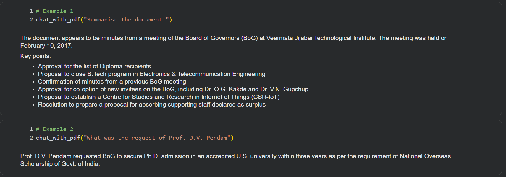
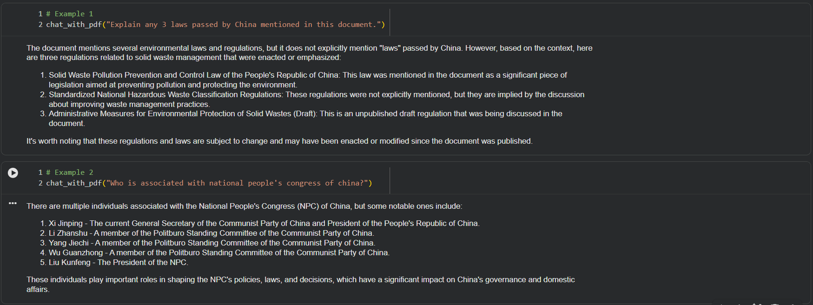
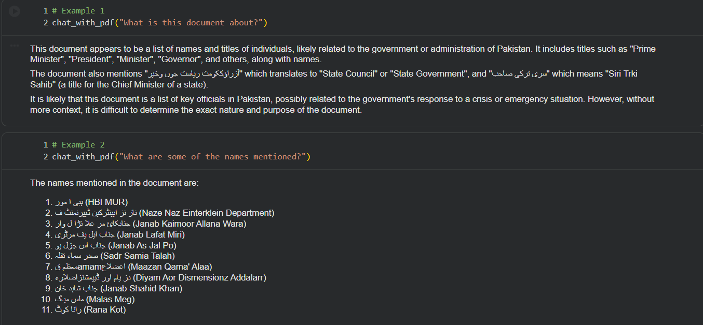

# Multi-Lingual-PDF-Chatbot


A Retrieval-Augmented Generation (RAG) pipeline designed to chat with PDF documents entirely locally. This project utilizes **Ollama** for the LLM and Embeddings, **ChromaDB** for vector storage, and a robust **Hybrid Text Extraction** system that handles both standard and scanned (image-based) PDFs of **different languages**.

## 🚀 Key Features

- **100% Local Privacy:** Uses local LLMs (Llama 3.2) and Embeddings (Nomic) via Ollama. No data leaves your machine.
- **Hybrid PDF Parsing:**
  - Attempts fast direct text extraction first (using `PyMuPDF`).
  - Automatically falls back to **OCR (Tesseract)** if the document is scanned or has low text density (< 100 words).
- **Multi-Language OCR Support:** Pre-configured to support English, Hindi, Urdu, Bengali, Marathi, and Chinese (Sim).
- **Advanced Retrieval:** Implements LangChain's `MultiQueryRetriever`, which generates multiple perspectives of a user's question to find better context matches.
- **Interactive Notebook:** Built as a Jupyter Notebook for easy experimentation and visualization.

## 🛠️ Prerequisites

Before running the notebook, you need the following installed on your system.

### 1. System Dependencies (Linux / Colab)

The notebook relies on `tesseract-ocr` for image processing and `poppler` for PDF conversion.

```bash
sudo apt-get update
sudo apt-get install -y tesseract-ocr poppler-utils libpci3

# Install specific language packs for OCR
sudo apt-get install -y \
  tesseract-ocr-hin \
  tesseract-ocr-urd \
  tesseract-ocr-ben \
  tesseract-ocr-eng \
  tesseract-ocr-mar \
  tesseract-ocr-chi-sim
```

### 2. Ollama

You must have Ollama installed and running.

Install Ollama, then pull the required models used in this notebook:

```bash
ollama pull llama3.2
ollama pull nomic-embed-text
```

## 📦 Installation

Clone the repository and install the Python dependencies:

```bash
pip install langchain_community langchain_ollama langchain_text_splitters langchain_core chromadb
pip install "unstructured[all-docs]" pymupdf pytesseract pdf2image Pillow
```

## 📖 Usage

1. Start Ollama:
Ensure your Ollama server is running (usually runs in the background or via ollama serve).

2. Open the Notebook:
Launch rag_notebook_ollama.ipynb in Jupyter Lab, Jupyter Notebook, or Google Colab.

3. Configure PDF Path: 
Find the configuration section in the notebook:
```bash
pdf_file_path = "/path/to/your/document.pdf"
language_code = "eng"  # or 'ben', 'hin', etc.
```

4. Run All Cells:
The notebook will:
- Check if the PDF requires OCR.
- Extract text and chunk it.
- Create a local Vector Database (Chroma).
- Initialize the Retrieval Chain.
  
5. Chat:
Use the chat_with_pdf("Your Question") function at the bottom of the notebook to query your document.

## ⚙️ How It Works
1. Hybrid Extraction Logic: 

The system avoids running slow OCR on every file. It uses a simple logic gate:

```bash
if direct_extraction_word_count >= 100:
    return direct_text
else:
    print("Switching to OCR...")
    return ocr_extraction(images)
```
2. Multi-Query Retrieval: 
Instead of searching for your exact question, the LLM generates different versions of your question to capture different nuances. This ensures that the vector search finds the most relevant document chunks even if your wording is slightly off.

## ⚠️ Troubleshooting: 
- Tesseract Not Found:
If running locally (not Colab), ensure Tesseract is in your system PATH.

- Ollama Connection Refused:
Make sure Ollama is running on 127.0.0.1:11434.

- ChromaDB Errors:
If you change the PDF, ensure you run the cleanup cell (at the end of the notebook):

```bash
vector_db.delete_collection()
```
This avoids mixing data from different PDFs.

## 📸 Sample Outputs

### RAG Chat Example
Here is the model answering a question based on the scanned document content using the local Llama 3.2 model.





## 🤝 Contributing

Feel free to fork this repository and submit pull requests. Suggestions for supporting more file types or different LLMs are welcome.
